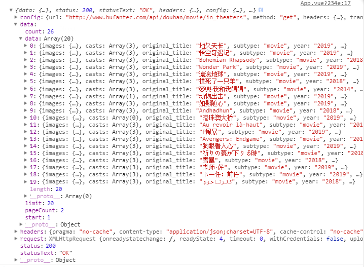

# axios
Axios 是一个基于 promise 的 HTTP 库，可以用在浏览器和 node.js 中。 类似jq的$.ajax
## axios特性

+ 从浏览器中创建 `XMLHttpRequests`
+ 从 `node.js` 创建 `http` 请求
+ 支持 `Promise` API
+ 拦截请求和响应
+ 转换请求数据和响应数据
+ 取消请求
+ 自动转换 JSON 数据
+ 客户端支持防御 `XSRF`(跨站请求伪造)

### axios安装 

使用 npm:

``` html
npm install axios --save
```
使用 cdn:
``` html
<script src="https://unpkg.com/axios/dist/axios.min.js"></script>
```

### 常用get/post请求
[不凡电影接口]("http://www.bufanui.com/designInfo/detail/6fd1d4a4ccb44c878ae72273bd3dca08" "不凡电影接口")
+ get请求 豆瓣电影接口
  - get请求不带参数
``` html
<script>
import axios from "axios";
export default {
  methods: {
    init(){
      axios.get('http://www.bufantec.com/api/douban/movie/in_theaters')
      .then(function (response) {
        console.log(response);
      })
      .catch(function (error) {
        console.log(error);
      });
    }
  },
  created () {
    this.init();
  }
}
</script>
```

   - get请求附带参数
``` html
<script>
import axios from "axios";
export default {
  methods: {
    init(){
      axios.get('http://www.bufantec.com/api/douban/movie/in_theaters?start=1&limit=10')
      // get请求附带参数的另一种写法
      /* axios.get('http://www.bufantec.com/api/douban/movie/in_theaters',{
        params:{
          start:2,
          limit:10
        }
      }) */
      .then(function (response) {
        console.log(response);
      })
      .catch(function (error) {
        console.log(error);
      });
    }
  },
  created () {
    this.init();
  }
}
</script>
```

+ post请求带参数
```html
<script>
import axios from "axios";
let datas = {
        Mob:18311111111,
        validcode:"815961",
        use:"regiVali"
      };
export default {
  methods: {
    init(){
      axios.post('http://order.gjw.com/Order_Api/GetValiCode',datas )
      .then(function (response) {
        console.log(response);
      })
      .catch(function (error) {
        console.log(error);
      });
    }
  },
  created () {
    this.init();
  }
}
</script>
```

### post请求注意事项 

axios 使用 post 发送数据时，默认是直接把 json 放到请求体中提交到后端的。也就是说，我们的 Content-Type 变成了 application/json;charset=utf-8 ,这是axios默认的请求头content-type类型。但是实际我们后端要求的 'Content-Type': 'application/x-www-form-urlencoded' 为多见，这就与我们不符合。
在HTTP协议消息头中，使用Content-Type来表示请求和响应中的媒体类型信息。它用来告诉服务端如何处理请求的数据，以及告诉客户端（一般是浏览器）如何解析响应的数据，比如显示图片，解析并展示html等等。
**post请求常见的数据格式（content-type）**

1. `Content-Type: application/json` ： 请求体中的数据会以json字符串的形式发送到后端(axios默认的)
2. `Content-Type: application/x-www-form-urlencoded`：请求体中的数据会以普通表单形式（键值对）发送到后端

解决方法
+ URLSearchParams   // 不支持ie
``` html
<script>
import axios from "axios";
let param = new URLSearchParams()
param.append('username', 'admin')
param.append('pwd', 'admin')
export default {
  methods: {
    init(){
      axios.post('http://localhost:3000/user',param )
      .then(function (response) {
        console.log(response);
      })
      .catch(function (error) {
        console.log(error);
      });
    }
  },
  created () {
    this.init();
  }
}
</script>
```
+ qs模块 qs模块在axios中默认自带
``` html
<script>
import axios from "axios";
import qs from "qs";
let datas = {
        Mob:18311111111,
        validcode:"815961",
        use:"regiVali"
      };
let params = qs.stringify(datas)
export default {
  methods: {
    init(){
      axios.post('http://localhost:3000/user',params )
      .then(function (response) {
        console.log(response);
      })
      .catch(function (error) {
        console.log(error);
      });
    }
  },
  created () {
    this.init();
  }
}
</script>
```
### axios执行多个并发请求
执行多个并发请求是通过`axios.all`完成  
`axios.all([function , function , ...])`
请求完成之后 会以数组的形式返回全部的请求数据
``` html
<script>
import axios from "axios";
axios.defaults.baseURL = 'http://localhost:3000';
import qs from "qs";
let datas = {
        Mob:18311111111,
        validcode:"815961",
        use:"regiVali"
      };
let params = qs.stringify(datas)
export default {
  methods: {
    init(){
      return axios.get('http://localhost:3000/')
     
    },
    getUserInfo(){
       return axios.post('http://localhost:3000/user',params )
      
    }
  },
  created () {
    axios.all([this.init(), this.getUserInfo()])
    .then((val)=>{  // val返回的是全部的请求
        console.log(val)
    });
  }
}
</script>
```
### 全局的 axios 默认值
+ `axios.defaults.baseURL` 设置默认公共请求地址baseURL
当我们的项目里面有很多的接口时 设置默认baseURL对后期的维护很有必要 
例如 开发环境访问的是开发时的数据库 生产环境访问的是线上数据库 开发和生产访问的不是一个地址
(开发环境是本地开发时的环境 生产环境是打包之后的环境)
``` html
<script>
if(process.env.NODE_ENV == "development"){
    axios.defaults.baseURL = 'http://localhost:3000';
}else{
    axios.defaults.baseURL = 'http://localhost:3001';
}
</script>
```
+ `axios.defaults.headers.common['Authorization'] = AUTH_TOKEN`;
如果你每次请求接口需要验证，就加这个，不需要验证那就不用加
+ `axios.defaults.headers.post['Content-Type'] = 'application/x-www-form-urlencoded'`或`{headers: {'Content-Type': 'application/x-www-form-urlencoded'}}`; // 设置请求头
``` html
<script>
import axios from "axios";
import qs from "qs";
axios.defaults.baseURL = 'http://localhost:3000';

let datas = {
        Mob:18311111111,
        validcode:"815961",
        use:"regiVali"
      };
let params = qs.stringify(datas)
export default {
  methods: {
    init(){
      return axios.get('/')
     
    },
    getUserInfo(){
       return axios.post('/user',datas ,{headers: {'Content-Type': 'application/x-www-form-urlencoded'}} )
    }
  },
  created () {
    console.log(process.env.NODE_ENV)
    if(process.env.NODE_ENV == "development"){
      axios.defaults.baseURL = 'http://localhost:3000';
    }else{
      axios.defaults.baseURL = 'http://localhost:3001';
    }
    axios.all([this.init(), this.getUserInfo()])
    .then((val)=>{
        console.log(val)
    });
  }
}
</script>
```

+ `axios.defaults.timeout = 2500`; 设置超时
  当后端返回数据过慢时设置了超时就会自动断开请求

### axios拦截器 interceptors  
页面发送http请求，很多情况我们要对请求和其响应进行特定的处理；如果请求数非常多，单独对每一个请求进行处理会变得非常麻烦，程序的优雅性也会大打折扣。好在强大的axios为开发者提供了这样一个API：拦截器。拦截器分为 请求（request）拦截器和 响应（response）拦截器。
> 前端请求接口时首先向服务端发送请求的接口加参数 这个步骤称之为request
request 对象代表了一个HTTP请求，其具有一些属性来保存请求中的一些数据，比如query string，body，HTTP headers等等。
+ query get请求附带的参数
+ body post请求附带的参数
+ HTTP headers 提交数据类型

> 服务端接收到请求之后响应数据 这个步骤称之为response
response里面存放的就是服务端返回给我们的数据，包括状态码，返回的数据格式等等

axios拦截器就是对这请求前和返回数据后的这两个过程执行操作

### axios拦截器 开始 类似路由守卫
+ 请求拦截器
  - config里面包含请求的参数 如请求地址 请求类似 请求参数等
```html
<script>
axios.interceptors.request.use(function (config) {
    // 在发起请求请做一些业务处理  
    // 如开启loading  对请求的参数做处理 添加token等
    // 例  在请求的时候开启elementui的loading
  loadings = Loading.service({ fullscreen: true });
  if(config.method == "post"){
      config.headers['Content-Type'] = 'application/x-www-form-urlencoded';
  }
  
  console.log(config)
    return config;
}, function (error) {
    // 对请求失败做处理
    return Promise.reject(error);
});
</script>

```
+ 响应拦截器
```html
<script>
axios.interceptors.response.use(function (config) {
    // 在请求之后做处理 如关闭loading
  loadings.close();
    return config;
}, function (error) {
    // 对请求失败做处理
    loadings.close();
    return Promise.reject(error);
});
</script>
```

### 封装常用的get/post请求
> 前言
get请求和post请求传参的写法
+ get请求传参
``` html
<script>
    axios.get('/user?ID=12345')
    axios.get('/user', {
        params: {
            ID: 12345
        }
    })
</script>

```
+ post请求传参的方式
```html
<script>
    axios.post('/user', {
        ID: 12345
    })
</script>

```
在src目录新建文件夹api
在api文件夹新建index.js
``` html
<script>
import axios from 'axios'
import { Loading } from 'element-ui'


const service = axios.create({
  baseURL: "http://localhost:3000", // api的base_url
  timeout: 5000 // request timeout
});
let loadings;

// request interceptor
service.interceptors.request.use(config => {
//   var token = sessionStorage.getItem("token")
//   if (token) {
//     // 让每个请求携带token-- ['X-Token']为自定义key 请根据实际情况自行修改
//     config.headers['X-Token'] = token
//   }
  if(config.method == "post"){
    config.headers['Content-Type'] = 'application/x-www-form-urlencoded';
  }
  loadings = Loading.service({ fullscreen: true });
  return config
}, error => {
  
  console.log(error)
  Promise.reject(error)
})

// respone interceptor
service.interceptors.response.use(
  response => {
    loadings.close();
    return response
  },
  /**
   * 下面的注释为通过在response里，自定义code来标示请求状态
   * 当code返回如下情况则说明权限有问题，登出并返回到登录页
   * 如想通过xmlhttprequest来状态码标识 逻辑可写在下面error中
   * 以下代码均为样例，请结合自生需求加以修改，若不需要，则可删除
   */
  // response => {
  //   const res = response.data
  //   if (res.code !== 20000) {
  //     Message({
  //       message: res.message,
  //       type: 'error',
  //       duration: 5 * 1000
  //     })
  //     // 50008:非法的token; 50012:其他客户端登录了;  50014:Token 过期了;
  //     if (res.code === 50008 || res.code === 50012 || res.code === 50014) {
  //       // 请自行在引入 MessageBox
  //       // import { Message, MessageBox } from 'element-ui'
  //       MessageBox.confirm('你已被登出，可以取消继续留在该页面，或者重新登录', '确定登出', {
  //         confirmButtonText: '重新登录',
  //         cancelButtonText: '取消',
  //         type: 'warning'
  //       }).then(() => {
  //           location.reload() // 为了重新实例化vue-router对象 避免bug
  //       })
  //     }
  //     return Promise.reject('error')
  //   } else {
  //     return response.data
  //   }
  // },
  error => {
    console.log('err' + error) // for debug
    loadings.close();
    return Promise.reject(error)
  })

export default service
</script>
```
调用的时候先引入`api/index.js`
也可以把它挂载到vue原型上
``` html
<script>
    import api from "@/api"
    Vue.prototype.$ajax = api;
</script>

```
调用的时候执行
```html
<script>
this.$ajax.post('/user',datas  ).then(res=>console.log(res))
</script>
```


