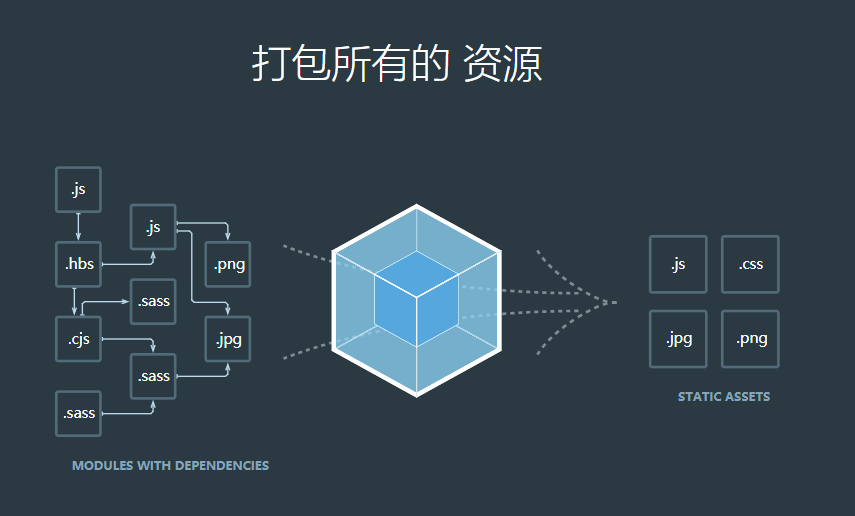

# webpack
## webpack简介
[webpack官网]("https://www.webpackjs.com/" "webpack官网")
webpack 是一个现代 JavaScript 应用程序的静态模块打包器(module bundler)。当 webpack 处理应用程序时，它会递归地构建一个依赖关系图(dependency graph)，其中包含应用程序需要的每个模块，然后将所有这些模块打包成一个或多个 bundle。
我们熟悉的`vue-cli`内置了`webpack`,可以把单文件组件打包成`html`


## webpack安装
本地安装  
```html
<script>
npm install --save-dev webpack
npm install --save-dev webpack-cli
</script>
```
## 初始化本地项目
webpack的配置文件是 `webpack.config.js`
新建项目 项目结构如下 
```html
<script>
 webpack-demo
  |- package.json
  |- webpack.config.js
  |- /dist
    |- index.html
  |- /src
    |- index.js
</script>
```
## require import/export 关系 
> 两者相同点
1. require import/export都是模块化的写法 
2. import/export 在浏览器里面是不支持这种语法的 require 在浏览器里面也不支持 
> 不同点 
1. import/export 是es6的模块化写法
2. require 是commonjs的模块化写法(commonjs是es6 import没出现之前使用的规范 也就是说这个是js爱好者搞出来的的 不是官方弄出来的 慢慢这个规范被js官方发现了 js官方就搞出了import/export 最早js是没有模块化的 )
3. require在nodejs里面是支持的   import/export在node里面不识别
4. 我们写的vue-cli的项目是运行在node的  但为什么能识别呢  这是因为vue-cli是基于webpack的 webpack会把import/export降级成require 这个时候node就可以识别import/export (具体转是通过babel的一个插件转的)

## webpack四个核心

+ 入口(entry)
+ 输出(output)
+ loader
+ 插件(plugins)

### entry 入口
入口起点(entry point)指示 webpack 应该使用哪个模块，来作为构建其内部依赖图的开始。进入入口起点后，webpack 会找出有哪些模块和库是入口起点（直接和间接）依赖的。
每个依赖项随即被处理，最后输出到称之为 bundles 的文件中。
webpack通过这个entry入口来查找入口文件  入口文件比如 `vue`中的`main.js` 里面包含了很多的组件或依赖
```html
<script>
    // 在webpack.config.js
    // module.exports是commonjs的规范  
module.exports = {
  entry: './path/to/my/entry/file.js'
};

</script>
```
### 输出(output) 
output 属性告诉 webpack 在哪里输出它所创建的 bundles，以及如何命名这些文件。
```html
<script>
    // 在webpack.config.js
module.exports = {
  entry: './path/to/my/entry/file.js',
  output: {
    path: path.resolve(__dirname, 'dist'),
    filename: 'my-first-webpack.bundle.js'
  }};


</script>
```
### loader
loader 让 webpack 能够去处理那些非 JavaScript 文件（webpack 自身只理解 JavaScript）。loader 可以将所有类型的文件转换为 webpack 能够处理的有效模块，然后你就可以利用 webpack 的打包能力，对它们进行处理。包括.css   less  sass   jpg  png 等。
```html
<script>
module.exports = {
  entry: './path/to/my/entry/file.js',
  output: {
    path: path.resolve(__dirname, 'dist'),
    filename: 'my-first-webpack.bundle.js'
  },
  module: {
    rules: [
      { test: /\.txt$/, use: 'raw-loader' }
    ]
  }};

</script>
```
### 插件 plugins
`plugins` 被用于转换某些类型的模块,插件的范围包括，从打包优化和压缩，一直到重新定义环境中的变量。插件接口功能极其强大，可以用来处理各种各样的任务。
```html
<script>
const HtmlWebpackPlugin = require('html-webpack-plugin'); // 通过 npm 安装
const webpack = require('webpack'); // 用于访问内置插件
module.exports = {
  module: {
    rules: [
      { test: /\.txt$/, use: 'raw-loader' }
    ]
  },
  plugins: [
    new webpack.optimize.UglifyJsPlugin(),
    new HtmlWebpackPlugin({template: './src/index.html'})
  ]

}
</script>
```

### source map 
用于追溯错误代码位置  在webpack.config.js里面加
`devtool: 'inline-source-map',`

### 热加载  webpack-dev-server 
每次更改文件都必须从新打包一次，很麻烦 
启用热加载能够帮助我们监听代码的变化自动进行打包代码


### 热模块替换（HMR)
官方文档有问题  


### tree shaking  中文官网是错误的
webpack在打包的时候默认删除文件中未使用的部分。
如 在index.js的同级新建math.js 里面有两个函数  
如果只引入cube  那么在打包的时候square是不会被打包进来的  如果需要square被导入 需要在webpack.config.js里面加入
`mode: 'development'`
```html
<script>
export function square(x) {
    return x * x;
  }
  
  export function cube(x) {
    return x * x * x;
  }
</script>
```

### 生产环境构建 
开发环境(`development`)和生产环境(`production`)的构建目标差异很大。在开发环境中，我们需要具有强大的、具有`实时重新加载(live reloading)`或`热模块替换(hot module replacement)`能力的 `source map` 和 `localhost server`。而在生产环境中，我们的目标则转向于关注更小的 bundle，更轻量的 source map，以及更优化的资源，以改善加载时间。由于要遵循逻辑分离，我们通常建议为每个环境编写彼此独立的 webpack 配置。
+ webpack.common.js 公用的配置文件
+ webpack.dev.js 开发时的配置文件 
+ webpack.prod.js 生产时的配置文件 

### 代码分离 

```html

<script>
 const path = require('path');
 const { CleanWebpackPlugin } = require('clean-webpack-plugin');
 const HtmlWebpackPlugin = require('html-webpack-plugin');

 module.exports = {
   entry: {
    index: './src/index.js',
    another: './src/another-module.js'
   },
   plugins: [
     // new CleanWebpackPlugin(['dist/*']) for < v2 versions of CleanWebpackPlugin
     new CleanWebpackPlugin(),
     new HtmlWebpackPlugin({
       title: 'Production'
     })
   ],
   optimization: {  // 公共代码抽离
         splitChunks: {
           chunks: 'all'
         }
       },
   output: {
     filename: '[name].bundle.js',
     path: path.resolve(__dirname, 'dist')
   }
 };
</script>
```
### 缓存 
使用 `webpack` 来打包我们的模块化后的应用程序，`webpack` 会生成一个可部署的 `/dist` 目录，然后把打包后的内容放置在此目录中。只要 `/dist` 目录中的内容部署到服务器上，客户端（通常是浏览器）就能够访问网站此服务器的网站及其资源。而最后一步获取资源是比较耗费时间的，这就是为什么浏览器使用一种名为 `缓存` 的技术。可以通过命中缓存，以降低网络流量，使网站加载速度更快，然而，如果我们在部署新版本时不更改资源的文件名，浏览器可能会认为它没有被更新，就会使用它的缓存版本。由于缓存的存在，当你需要获取新的代码时，就会显得很棘手。
webpack解决缓存
`filename: '[name].[contenthash].js'`

> runtime
 runtime 指的是 webpack 的运行环境(具体作用就是模块解析, 加载) 和 模块信息清单
 解决方法
 `runtimeChunk: 'single'`
> 缓存基本不变的依赖 
将第三方库（例如lodash或）提取react到单独的vendor块中也是一种很好的做法，因为它们比我们的本地源代码更不可能更改。
后端缓存这些基本不变的依赖对用户的体验很好
```html
<script>
 optimization: {
    runtimeChunk: 'single',
    splitChunks: {
      cacheGroups: {
        vendor: {
          test: /[\\/]node_modules[\\/]/,
          name: 'vendors',
          chunks: 'all'
        }
      }
    }
       },
</script>
```